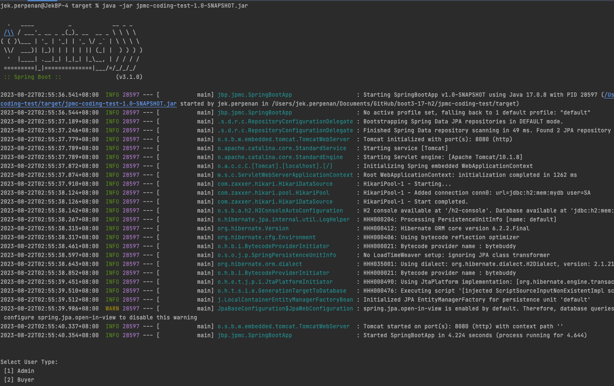
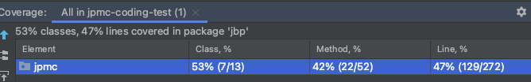

# Coding Test - JPMorgan Chase & Co.
Created by: Jakeler Perpenan 

Tech Stack: Springboot 3, Java 17, h2 in-memory database, JUnit 5

Github URL: https://github.com/jbperpenan/boot3-17-h2/tree/feature/jpmc-coding-test

Running the jar file: java -jar <'path to project'>/jpmc-coding-test/target/jpmc-coding-test-1.0-SNAPSHOT.jar
   - 

Assumptions:
- Additional assumptions here are on top of the email initial requirements
- The input 'showNumber' is unique but not auto generated, validation is in place  
- The app user is cable of switching from being 'Admin' or 'Buyer' user while using the app
- 'Admin - View Shows' and 'Buyer - Seats Availability' can show all records if no 'show number' input is provided
- Unit test coverage focuses on essential business logic (main services and validators)
- App is not designed nor tested in distributed deployment context
- Configuring allowed cancellation window is defined in creating Show instance and not based on config file
- 0 is invalid value for both number of rows and seats
- Phone number input is string and does not have additional validation for verifying correctness of mobile number
- Successfully CANCELLED seat bookings can be booked again

Unit Tests Coverage:
   - 